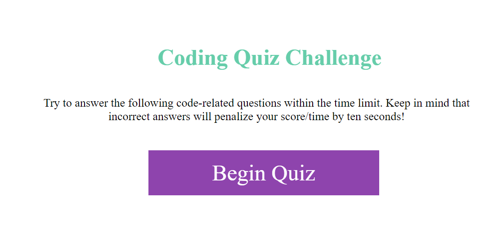
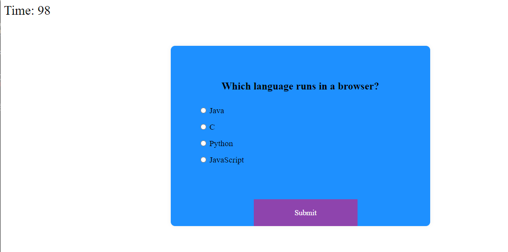
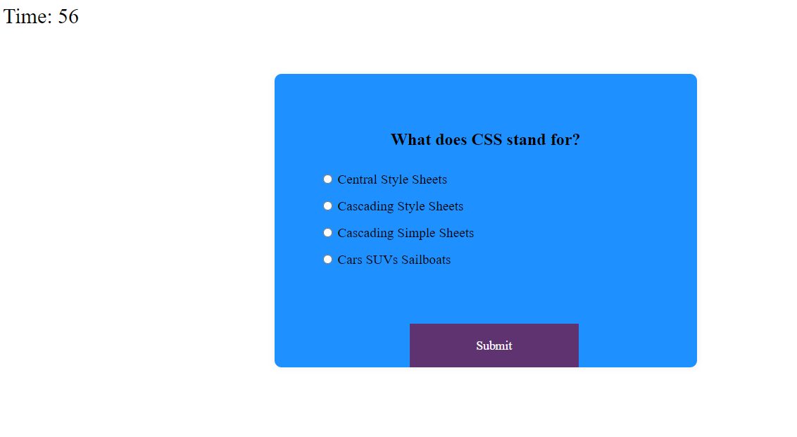
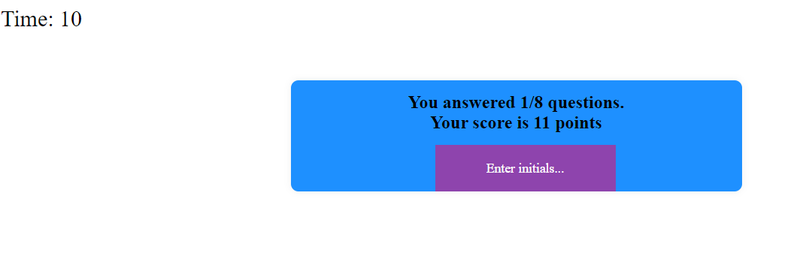
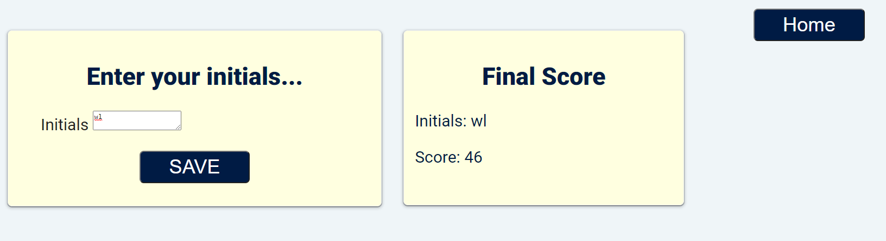

# GT-Coding Bootcamp -- 04 Web APIs: Code Quiz

## Table of Contents

1. Overview
2. Directory Structure
3. Mock-Up
4. Links to deployed application

## 1. Overview:

This is a timed-coding quiz with multiple-choice questions. This app will run in the browser and will feature dynamically updated HTML and CSS powered by JavaScript code. It will have a clean, polished, and responsive user interface. The quiz has 10 questions. Ten seconds are taken off for each wrong answer. If you run out of time, you get zero. Otherwise, your score is equal to the time when you finished answering all questions.

## 2. Directory Structure

## 3. Mock-Up

The following image shows the web application's appearance and functionality:

## 4. Links to deployed application

[Click here to go to github repository.](https://github.com/willielibet/gt-bootcamp-quiz-app-js-html-css.git)

[Click here to go to deployed application.](https://willielibet.github.io/gt-bootcamp-quiz-app-js-html-css/)
